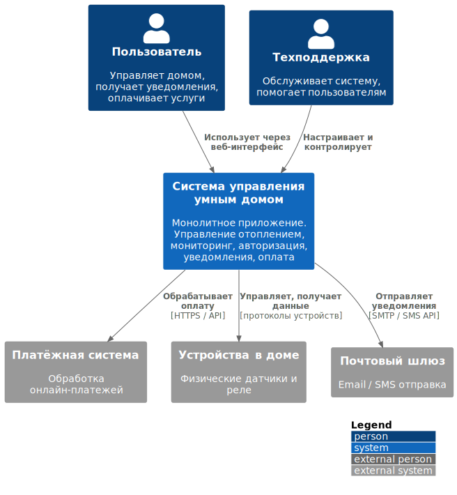

# Project_template

# Задание 1. Анализ и планирование

### 1. Описание функциональности монолитного приложения

**Управление отоплением:**

Пользователи могут:
- включать/выключать отопление.
- регулировать температуру.

Система поддерживает:
- установка разных температур в разных помещениях
- поддержание нужной температуры

**Мониторинг температуры:**

Пользователи могут:
- просматривать текущую температуру
- просматривать графики, историю изменения температуры

Система поддерживает:
- сбор и хранение данных с датчиков
- уведомление пользователей по заданным параметрам. Например, "температура достигла заданной"
- создание графиков, анализ, агрегация. Например, "график изменения температуры за определённый период", "мин/среднее/макс температура".

### 2. Анализ архитектуры монолитного приложения

Приложение написано на Java.

Всё синхронно. Никаких асинхронных вызовов, микросервисов и реактивного. Всё управление идёт от сервера к датчику. Данные о температуре также получаются через запрос от сервера к датчику.

Все данные хранятся в единственной бд, PostgreSQL.

Все компоненты находятся в одном монолитном приложении: веб-интерфейс, авторизация и аутентификация, управление отоплением, мониторинг температуры, уведомления (email/sms), оплата услуг.

Есть веб-интерфейс, через который можно просматривать и регулировать текущую температуру. Через веб-интерфейс пользователь отправляет запрос на сервер, сервер отправляет запрос к датчикам, сервер перенаправляет ответ пользователю.

Развёртывание требует остановки всего приложения.

Мастабирование только вертикальное, т.е. за счёт увеличение ресурсов сервера.

У приложения 100 веб-клиентов, к системе подключены 100 модулей управления отоплением. 

### 3. Определение доменов и границы контекстов

- Управление отоплением
    - Ответственность: Включение/выключение отопления, света, розеток и т.д.
Основные сущности: Устройство, Комната, Команда управления
Контекст: Device Control

- Мониторинг температуры
Ответственность: Получение и хранение данных с датчиков (температура, движение, влажность)
Основные сущности: Датчик, Значение, Время измерения
Контекст: Sensor Monitoring

3. Пользователи и доступ
Ответственность: Регистрация, логин, разграничение прав
Основные сущности: Пользователь, Роль, Токен доступа
Контекст: Identity & Access Management

4. Уведомления
Ответственность: Отправка оповещений пользователям (email, SMS)
Основные сущности: Сообщение, Шаблон, Канал связи
Контекст: Notification

5. История и аналитика
Ответственность: Хранение истории действий, построение отчётов
Основные сущности: Лог события, Отчёт, Сводка
Контекст: Analytics & Logging

6. Оплата услуг
Ответственность: Учёт тарифов, выставление счетов, приём и проверка платежей
Основные сущности: Счёт, Тариф, Платёж, Способ оплаты
Контекст: Billing & Payments

### **4. Проблемы монолитного решения**

- **Высокий риск ошибок.** Изменения в одной части приложения могут непредсказуемо влиять на другие части. Из-за этого вырастает вероятность возникновения ошибок и компании приходится тратить дополнительные ресурсы на тестирование.
- **Длительные циклы разработки и развёртывания.** При каждом изменении приходится тестировать всё приложение целиком. Это замедляет выпуск новых функций.
- **Трудно управлять командой.** В больших командах работа над монолитом часто приводит к конфликтам и задержкам. Изменения, которые вносит одна команда, влияют на работу других команд.
- **Трудно масштабировать отдельные компоненты системы.** Например, часть системы, которая отвечает за мониторнг температуры, испытывает высокую нагрузку. С монолитной архитектурой не получится масштабировать только эту часть — придётся масштабировать приложение целиком.
- **Долгий деплой**. Любое изменение требует полной пересборки и выката всего приложения.

### 5. Визуализация контекста системы — диаграмма С4
[Ссылка диаграмму контекста в модели C4 на PlantUML](./docs/architecture/monolith/context.svg)

То же самое в виде картинки:

# Задание 2. Проектирование микросервисной архитектуры

В этом задании вам нужно предоставить только диаграммы в модели C4. Мы не просим вас отдельно описывать получившиеся микросервисы и то, как вы определили взаимодействия между компонентами To-Be системы. Если вы правильно подготовите диаграммы C4, они и так это покажут.

**Диаграмма контейнеров (Containers)**

Добавьте диаграмму.

**Диаграмма компонентов (Components)**

Добавьте диаграмму для каждого из выделенных микросервисов.

**Диаграмма кода (Code)**

Добавьте одну диаграмму или несколько.

# Задание 3. Разработка ER-диаграммы

Добавьте сюда ER-диаграмму. Она должна отражать ключевые сущности системы, их атрибуты и тип связей между ними.

Четвёртое задание — дополнительное. Его можно сделать по желанию. Чтобы ревьюер быстрее проверил ваше решение, укажите, сделали вы это задание или нет. Для этого оставьте нужный эмодзи около заголовка задания:

✅ — вы выполнили задание.

❌ — вы пропустили задание.

# ✅ ❌ Задание 4. Создание и документирование API

### 1. Тип API

Укажите, какой тип API вы будете использовать для взаимодействия микросервисов. Объясните своё решение.

### 2. Документация API

Здесь приложите ссылки на документацию API для микросервисов, которые вы спроектировали в первой части проектной работы. Для документирования используйте Swagger/OpenAPI или AsyncAPI.
